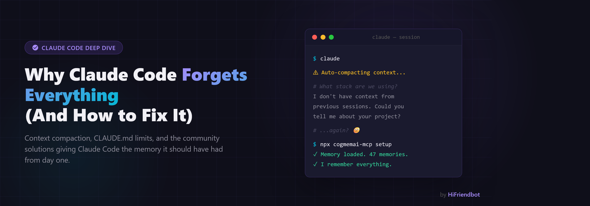

<p align="center">
  
</p>

[](https://www.npmjs.com/package/cogmemai-mcp)
[](https://opensource.org/licenses/MIT)
[](https://hifriendbot.com/developer/)

# CogmemAi — Cognitive Memory for Ai Coding Assistants

<p align="center">
  
</p>

**Your Ai coding assistant forgets everything between sessions. CogmemAi fixes that.**

One command. Your assistant remembers your architecture, patterns, decisions, bugs, and preferences — permanently. Works with Claude Code, Cursor, Windsurf, Cline, Continue, and any MCP-compatible tool. Switch editors, switch models, switch machines — your knowledge stays.

## What's New in v3

### Think Before You Speak — Proactive Memory Recall (v3.12)

CogmemAi now **thinks before it speaks**. Before your Ai assistant suggests any action, approach, or recommendation, CogmemAi checks its memory first — automatically, on every topic.

- **`preflight` tool** — A fast, lightweight recall designed to be called before every suggestion. Your assistant checks what it already knows about a topic before opening its mouth. "Let's try approach X" → first checks if X was already tried, rejected, or completed. Sub-200ms, near-zero cost.
- **Prior context surfacing** — Every time a memory is saved, CogmemAi automatically searches for related prior memories across all topics — people, companies, technical approaches, features, everything — and surfaces them in the response. Your assistant never suggests something redundant.
- **Smart recall hooks** — In Claude Code, CogmemAi reads every user message and automatically injects relevant memories before the assistant responds. No manual recall needed — context arrives before the assistant starts thinking.
- **Upgraded recall engine** — Higher-dimensional semantic understanding, balanced reranking, keyword-expanded search, dual-path memory storage for more reliable retrieval, and adaptive search that expands automatically when initial results are low confidence.

The result: your Ai assistant stops suggesting things you've already tried, people you've already contacted, and approaches you've already rejected. Your brain is no longer the safety net for what your tools should already know.

### Wisdom Engine — Auto-Extracted Principles (v3.10)

CogmemAi now automatically detects patterns across your memories and extracts **factual principles**. While skills tell your Ai HOW to behave ("always use Zustand"), principles tell it what's TRUE about your project ("this codebase never validates inputs at service boundaries"). Principles are extracted from clusters of 5+ related memories, scored by confidence, and injected into every session. Use `extract_principles` to trigger manually or let it happen automatically.

### Remote MCP — Zero Install (v3.9)

CogmemAi now supports **Streamable HTTP transport** — connect from any MCP client without installing anything. No npm, no config files, no Node.js required. Just point your client to `https://hifriendbot.com/mcp/` with your API key and start using persistent memory immediately. Same 29 tools, same Intelligence Engine, same 91% benchmark accuracy — zero setup friction.

### Quantum-Safe Encryption (v3.7)

CogmemAi is the **first quantum-safe Ai memory system.** All memories are encrypted at rest with quantum-resistant encryption — both in cloud mode and local mode. Your data is protected against today's threats and tomorrow's quantum computers. Encryption is automatic, zero-config, and enabled by default. No setup required.

### Choose Your Storage Mode (v3.6)

CogmemAi now runs three ways — pick the one that fits your workflow:

| | Cloud (default) | Local | Hybrid |
|---|---|---|---|
| **Best for** | Full intelligence, team collaboration, cross-device portability | Zero-config start, offline-only environments | Local speed + cloud brains, travel/unreliable networks |
| **Setup** | `npx cogmemai-mcp setup` (choose Cloud) | `npx cogmemai-mcp setup` (choose Local) | `npx cogmemai-mcp setup` (choose Hybrid) |
| **API key needed** | Yes (free) | Yes (free) — like a license key, your data stays local | Yes (free) |
| **Search** | Semantic (by meaning) | Full-text search (FTS5) | Semantic with local fallback |
| **Intelligence Engine** | Full — auto-linking, contradiction detection, memory decay, auto-skills, query synthesis | FTS5 search + CRUD — data stays on your machine | Full — with offline resilience |
| **Team collaboration** | Yes | No | Yes |
| **Cross-device sync** | Automatic | No — data stays on your machine | Automatic with local cache |
| **Offline support** | Requires internet | Full offline | Falls back to local when offline |
| **Encryption** | Quantum-safe (server) | Quantum-safe (local) | Quantum-safe (both) |

**Cloud mode is the recommended experience.** It gives you the full Intelligence Engine — semantic search that finds memories by meaning, auto-linking knowledge graph, contradiction detection, self-improving recall, auto-skills, query synthesis, and team collaboration. Everything that makes CogmemAi more than just a database.

**Local mode keeps your data on your machine.** A free API key is required for registration (like a software license key), but all your data stays local. Full-text search (FTS5) provides quality recall. Works offline after initial setup. When you're ready for semantic search and the full Intelligence Engine, upgrading to cloud takes one command.

**Hybrid mode is for developers who travel or work on unreliable networks.** Saves to both local and cloud simultaneously. Reads from cloud when available, falls back to local when offline. Unsynced memories automatically push to cloud when connectivity returns.

### Intelligence Engine + Auto-Skills (v3.5)

CogmemAi now gets smarter every time you use it. The Intelligence Engine is a self-improving memory system that learns what matters, connects related knowledge automatically, and synthesizes answers from your entire memory. Auto-Skills takes it further — CogmemAi doesn't just remember, it **learns how to behave**.

### Auto-Skills (Closed-Loop Learning)

- **Behavioral skills** — CogmemAi automatically synthesizes your corrections, preferences, and patterns into behavioral directives that tell your Ai assistant HOW to work, not just what to know
- **Closed learning loop** — correct your assistant once, and CogmemAi detects the pattern. After enough evidence accumulates, it generates a skill that prevents the mistake from ever happening again
- **Confidence tracking** — each skill has a confidence score that rises when it works and drops when it doesn't. Low-confidence skills are automatically retired
- **Self-evaluation** — skills periodically review themselves against new evidence and adapt, strengthen, or retire as your practices evolve

### Intelligence Engine — 91% Accuracy on LoCoMo Benchmark (Above Human Performance)

CogmemAi scores **91% accuracy** on the [LoCoMo conversational memory benchmark](https://github.com/snap-research/locomo), with **100% retrieval hit rate**. That's above human performance (87.9%) on this benchmark and competitive with the top Ai memory systems. CogmemAi finds the right memories when you need them.

- **Precision reranking** — every recall runs a second-pass reranker that re-scores candidates for precision, balanced with the initial ranking signal to surface the most relevant memory first
- **Self-improving recall** — memories that consistently help you rank higher over time; memories you never use fade naturally. Your recall quality improves automatically with every session
- **Auto-linking knowledge graph** — related memories are automatically connected when you save them. Your knowledge builds into a web of relationships, not a flat list
- **Contradiction detection** — when recalled memories conflict with each other, CogmemAi flags the contradiction so you catch stale or outdated information before it causes problems
- **Context-aware ranking** — tell CogmemAi what you're doing (debugging, planning, reviewing) and it boosts the right types of memories. Debugging? Bug reports and patterns surface first. Planning? Architecture decisions lead
- **Query synthesis** — ask a question and get one coherent answer synthesized from all your relevant memories, not just a list of matches. Like asking a teammate who's read everything
- **Cross-project intelligence** — patterns that appear across 3+ projects are automatically promoted to global scope. Your best practices follow you everywhere without manual effort
- **Proactive insights** — at session start, CogmemAi tells you what you should know before you ask. Stale critical memories, duplicate subjects that need merging, patterns ready for promotion

### Also in v3

- **Memory health score** — 0-100 score with actionable factors
- **Session replay** — pick up exactly where you left off with automatic session summaries
- **Self-tuning memory** — importance adjusts based on real usage; stale memories auto-archive
- **Auto-ingest README** — learn from your README on new projects instantly
- **Smart recall** — relevant memories surface automatically as you switch topics
- **Auto-learning** — CogmemAi learns from your sessions automatically
- **Task tracking** — persistent tasks with status and priority
- **Correction learning** — teach your assistant to avoid repeated mistakes
- **Session reminders** — nudges that surface at the start of your next session
- **Mandatory rules** — define absolute requirements ("NEVER do X", "ALWAYS do Y") that surface in every session, bypassing all scoring and decay
- **35 tools** — the most complete memory toolkit for Ai coding assistants

## Quick Start

### Option 1: Remote (Zero Install)

Connect directly — no npm, no setup, no config files. Just add the remote endpoint to your MCP client with your API key:

**Endpoint:** `https://hifriendbot.com/mcp/`
**Auth:** Bearer token (your `cm_` API key)

Get your free API key at [hifriendbot.com/developer](https://hifriendbot.com/developer/).

Works with any MCP client that supports Streamable HTTP transport (Claude Desktop, Cursor, and more).

### Option 2: Local Install

```bash
npx cogmemai-mcp setup
```

The setup wizard walks you through three choices: **Cloud** (recommended — full Ai intelligence), **Local** (data stays on your machine), or **Hybrid** (both). Pick your mode, enter your API key if needed, and you're ready in under 60 seconds.

Don't have an API key yet? Get one free at [hifriendbot.com/developer](https://hifriendbot.com/developer/). Or choose Local mode to start immediately with no account.

## The Problem

Every time you start a new session, you lose context. You re-explain your tech stack, your architecture decisions, your coding preferences. Built-in memory in tools like Claude Code is a flat file with no search, no structure, and no intelligence.

CogmemAi gives your Ai assistant a real memory system:

- **Semantic search** — finds relevant memories by meaning, not keywords
- **Ai-powered extraction** — automatically identifies facts worth remembering from your conversations
- **Smart deduplication** — detects duplicate and conflicting memories automatically
- **Privacy controls** — auto-detects API keys, tokens, and secrets before storing
- **Document ingestion** — feed in READMEs and docs to instantly build project context
- **Project scoping** — memories tied to specific repos, plus global preferences that follow you everywhere
- **Smart context** — intelligently ranked for maximum relevance to your current work
- **Compaction recovery** — survives Claude Code context compaction automatically
- **Token-efficient** — compact context loading that won't bloat your conversation
- **Zero setup** — no databases, no Docker, no Python, no vector stores

## Why Cloud Is the Recommended Mode

CogmemAi offers three storage modes, but cloud is where the magic happens. The Intelligence Engine — semantic search, auto-linking knowledge graph, contradiction detection, self-improving recall, auto-skills, and query synthesis — runs server-side. In cloud mode, your MCP server is a thin HTTP client with **zero local databases, zero RAM issues, zero maintenance.** All memories are encrypted at rest, so your data is just as secure as local storage — with cross-device portability and team features on top.

**Your memory follows you everywhere.** Memories created in Claude Code are instantly available in Cursor, Windsurf, Cline, and any MCP-compatible tool. Switch between Opus, Sonnet, Haiku, or any model your editor supports — your memories persist regardless. New laptop? New OS? Log in and your full project knowledge is waiting. A local SQLite file dies with your machine. Cloud memory is permanent.

**The privacy argument is a myth.** Some memory tools market "local-first" as a privacy advantage. But think about what happens next: every memory your Ai reads gets sent to the model provider (Anthropic, OpenAI, Google) as part of the prompt. Your data leaves your machine at inference time no matter where it's stored. A local SQLite file doesn't protect your memories — it just makes them harder to search, slower to access, and impossible to share. CogmemAi encrypts at rest, transmits over HTTPS, and adds intelligence that local storage simply can't match.

**Teams and collaboration.** Cloud memory is the only way to share project knowledge across teammates. When one developer saves an architecture decision or documents a bug fix, every team member's Ai assistant knows about it instantly. No syncing, no merge conflicts, no stale local databases. Whether it's two developers or twenty, everyone's assistant has the same up-to-date context. This is impossible with local-only memory solutions.

## Compaction Recovery

When your Ai assistant compacts your context, conversation history gets compressed and context is lost. CogmemAi handles this automatically — your context is preserved before compaction and seamlessly restored afterward. No re-explaining, no manual prompting.

The `npx cogmemai-mcp setup` command configures everything automatically.

## Skill

CogmemAi includes a [Claude Skill](https://github.com/hifriendbot/cogmemai-mcp/tree/main/skill/cogmemai-memory) that teaches Claude best practices for memory management — when to save, importance scoring, memory types, and session workflows.

**Claude Code:**
```
/skill install https://github.com/hifriendbot/cogmemai-mcp/tree/main/skill/cogmemai-memory
```

**Claude.ai:** Upload the `skill/cogmemai-memory` folder in Settings > Skills.


## CLI Commands

```bash
npx cogmemai-mcp setup          # Interactive setup wizard
npx cogmemai-mcp setup <key>    # Setup with API key
npx cogmemai-mcp verify         # Test connection and show usage
npx cogmemai-mcp --version      # Show installed version
npx cogmemai-mcp help           # Show all commands
```

## Manual Setup

If you prefer to configure manually instead of using `npx cogmemai-mcp setup`:

**Option A — Per project** (add `.mcp.json` to your project root):

```json
{
  "mcpServers": {
    "cogmemai": {
      "command": "cogmemai-mcp",
      "env": {
        "COGMEMAI_API_KEY": "cm_your_api_key_here"
      }
    }
  }
}
```

For local mode (free API key required for registration, data stays local):
```json
{
  "mcpServers": {
    "cogmemai": {
      "command": "cogmemai-mcp",
      "env": {
        "COGMEMAI_MODE": "local",
        "COGMEMAI_API_KEY": "cm_your_api_key_here"
      }
    }
  }
}
```

**Option B — Global** (available in every project):

```bash
# Cloud (default)
claude mcp add cogmemai cogmemai-mcp -e COGMEMAI_API_KEY=cm_your_api_key_here --scope user

# Local (free API key required, data stays local)
claude mcp add cogmemai cogmemai-mcp -e COGMEMAI_API_KEY=cm_your_api_key_here -e COGMEMAI_MODE=local --scope user

# Hybrid (both)
claude mcp add cogmemai cogmemai-mcp -e COGMEMAI_API_KEY=cm_your_api_key_here -e COGMEMAI_MODE=hybrid --scope user
```

## Works With

### Claude Code (Recommended)

Automatic setup:
```bash
npx cogmemai-mcp setup
```

### Cursor

Add to `~/.cursor/mcp.json`:
```json
{
  "mcpServers": {
    "cogmemai": {
      "command": "npx",
      "args": ["-y", "cogmemai-mcp"],
      "env": { "COGMEMAI_API_KEY": "cm_your_api_key_here" }
    }
  }
}
```

### Windsurf

Add to `~/.codeium/windsurf/mcp_config.json`:
```json
{
  "mcpServers": {
    "cogmemai": {
      "command": "npx",
      "args": ["-y", "cogmemai-mcp"],
      "env": { "COGMEMAI_API_KEY": "cm_your_api_key_here" }
    }
  }
}
```

### Cline (VS Code)

Open VS Code Settings > Cline > MCP Servers, add:
```json
{
  "cogmemai": {
    "command": "npx",
    "args": ["-y", "cogmemai-mcp"],
    "env": { "COGMEMAI_API_KEY": "cm_your_api_key_here" }
  }
}
```

### Continue

Add to `~/.continue/config.yaml`:
```yaml
mcpServers:
  - name: cogmemai
    command: npx
    args: ["-y", "cogmemai-mcp"]
    env:
      COGMEMAI_API_KEY: cm_your_api_key_here
```

### CogmemUI

[CogmemUI](https://hifriendbot.com/cogmemui/) is a free multi-model Ai workspace with built-in CogmemAi memory. Add your CogmemAi API key in **Settings > API Keys** and your memory is instantly available. CogmemUI also supports connecting any MCP-compatible tool server via **Settings > MCP Servers** — add endpoints, auto-discover tools, and use them in chat.

Get your free API key at [hifriendbot.com/developer](https://hifriendbot.com/developer/).

## Tools

CogmemAi provides 35 tools that your Ai assistant uses automatically:

| Tool | Description |
|------|-------------|
| `preflight` | **Think Before You Speak.** Fast recall to check prior context before making any suggestion |
| `save_memory` | Store a fact explicitly (architecture decision, preference, etc.) |
| `recall_memories` | Search memories using natural language (semantic search) |
| `extract_memories` | Ai extracts facts from a conversation exchange automatically |
| `get_project_context` | Load top memories at session start (with smart ranking, health score, and session replay) |
| `list_memories` | Browse memories with filters (paginated, with untyped filter) |
| `update_memory` | Update content, importance, scope, type, category, subject, and tags |
| `delete_memory` | Permanently delete a memory |
| `bulk_delete` | Delete up to 100 memories at once |
| `bulk_update` | Update up to 50 memories at once (content, type, category, tags, etc.) |
| `get_usage` | Check your usage stats and tier info |
| `export_memories` | Export all memories as JSON for backup or transfer |
| `import_memories` | Bulk import memories from a JSON array |
| `ingest_document` | Feed in a document (README, API docs) to auto-extract memories |
| `save_session_summary` | Save a summary of what was accomplished in this session |
| `list_tags` | View all tags in use across your memories |
| `link_memories` | Connect related memories with named relationships |
| `get_memory_links` | Explore the knowledge graph around a memory |
| `get_memory_versions` | View edit history of a memory |
| `get_analytics` | Memory health dashboard with self-tuning insights (filterable by project) |
| `promote_memory` | Promote a project memory to global scope |
| `consolidate_memories` | Merge related memories into comprehensive summaries using Ai |
| `save_task` | Create a persistent task with status and priority tracking |
| `get_tasks` | Retrieve tasks for the current project — pick up where you left off |
| `update_task` | Change task status, priority, or description as you work |
| `save_correction` | Store a "wrong approach → right approach" pattern to avoid repeated mistakes |
| `set_reminder` | Set a reminder that surfaces at the start of your next session |
| `get_stale_memories` | Find memories that may be outdated for review or cleanup |
| `get_file_changes` | See what files changed since your last session |
| `feedback_memory` | Signal whether a recalled memory was useful or irrelevant to improve future recall |
| `generate_skills` | Trigger skill generation from your corrections and preferences — or preview candidates with dry run |
| `save_rule` | Save a mandatory rule that surfaces in every session — bypasses all scoring and decay |
| `list_rules` | List all mandatory rules for the current project and/or globally |
| `delete_rule` | Delete a mandatory rule by ID |
| `extract_principles` | Trigger Wisdom Engine to detect factual patterns across memory clusters |

## SDKs

Build your own integrations with the CogmemAi API:

- **JavaScript/TypeScript:** `npm install cogmemai-sdk` — [npm](https://www.npmjs.com/package/cogmemai-sdk) · [GitHub](https://github.com/hifriendbot/cogmemai-sdk)
- **Python:** `pip install cogmemai` — [PyPI](https://pypi.org/project/cogmemai/) · [GitHub](https://github.com/hifriendbot/cogmemai-python)

## Memory Types

Memories are categorized for better organization and retrieval:

- **identity** — Who you are, your role, team
- **preference** — Coding style, tool choices, conventions
- **architecture** — System design, tech stack, file structure
- **decision** — Why you chose X over Y
- **bug** — Known issues, fixes, workarounds
- **dependency** — Version constraints, package notes
- **pattern** — Reusable patterns, conventions
- **context** — General project context
- **task** — Persistent tasks with status and priority tracking
- **correction** — Wrong approach → right approach patterns
- **reminder** — Next-session nudges that auto-expire
- **rule** — Mandatory directives that surface in every session, bypassing all scoring and decay

## Scoping

- **Project memories** — Architecture, decisions, bugs specific to one repo. Auto-detected from your repository.
- **Global memories** — Your coding preferences, identity, tool choices. Available in every project.

## Pricing

| | Free | Pro | Team | Enterprise |
|---|---|---|---|---|
| **Price** | $0 | $14.99/mo | $39.99/mo | $99.99/mo |
| **Memories** | 500 | 2,000 | 10,000 | 50,000 |
| **Extractions/mo** | 500 | 2,000 | 5,000 | 20,000 |
| **Projects** | 5 | 20 | 50 | 200 |

Start free. Upgrade when you need more. Or pay per operation with USDC on-chain — no credit card required.

## Privacy & Security

- **🛡️ Quantum-safe encryption at rest.** All memories are encrypted with quantum-resistant cryptography — in cloud mode and local mode. Protected against both current threats and future quantum computers.
- **No source code leaves your machine.** We store extracted facts (short sentences), never raw code.
- **API keys cryptographically hashed** (irreversible) server-side.
- **All traffic over HTTPS.**
- **No model training** on your data. Ever.
- **Delete everything** instantly via dashboard or MCP tool.
- **No cross-user data sharing.**

Read our full [privacy policy](https://hifriendbot.com/privacy-policy/).

## Environment Variables

| Variable | Required | Description |
|----------|----------|-------------|
| `COGMEMAI_API_KEY` | Cloud/Hybrid | Your API key (starts with `cm_`). Not needed for local mode. |
| `COGMEMAI_MODE` | No | Storage mode: `cloud` (default), `local` (data stays on your machine), or `hybrid` |
| `COGMEMAI_LOCAL_DB` | No | Path to local database (default: `~/.cogmemai/local.db`). Used in local and hybrid modes. |
| `COGMEMAI_API_URL` | No | Custom API URL (default: hifriendbot.com) |
| `COGMEMAI_ENCRYPTION_KEY` | No | Custom encryption passphrase for local mode. If not set, a key is auto-generated. |
| `COGMEMAI_LOCAL_ENCRYPTION` | No | Set to `off` to disable local encryption (not recommended). |

## Support

- Issues: [GitHub Issues](https://github.com/hifriendbot/cogmemai-mcp/issues)
- Docs: [hifriendbot.com/developer](https://hifriendbot.com/developer/)

## License

MIT — see [LICENSE](./LICENSE)

---

Built by [HiFriendbot](https://hifriendbot.com) — Better Friends, Better Memories, Better Ai. 🛡️ Quantum Safe.
